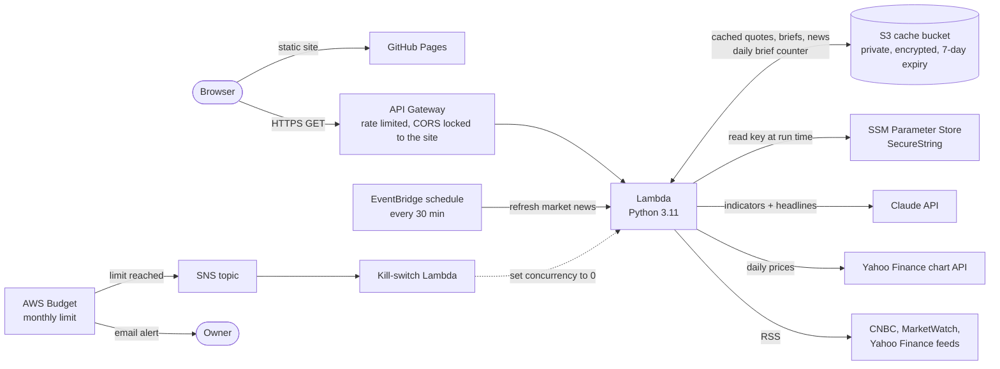

# MarketPulse

MarketPulse reads a stock's chart for you. Pick a symbol and it shows the price history, works out the trend, momentum and risk numbers, has Claude explain them in plain language, and lists what the news is saying.

**Live site:** https://kowshik-anirudh.github.io/ai-stock-storyteller/

Educational use only. Nothing here is investment advice.

## What it does

- **Chart.** Daily candles with volume, 20/50/200-day averages you can switch on and off, an RSI panel, and a comparison against the S&P 500.
- **Key numbers.** Returns over a week, month, quarter and year, volatility, beta, drawdown, typical daily swing and the 52-week range, each with a one-line explanation.
- **The brief.** A short write-up by Claude that ties the numbers together: what is working, what to watch, and the nearest support and resistance. It only uses the numbers computed by the backend.
- **News.** Recent headlines for the symbol, plus market headlines that refresh every 30 minutes. Only the headline, source and link are shown; each link goes to the publisher.
- **Ticker dropdown, watchlist and shareable links.** The watchlist is stored in your browser only.

## How it runs on AWS



**Request path.** The site is static and hosted on GitHub Pages. It calls three endpoints on API Gateway, which invoke one Lambda function:

| Endpoint | What it returns | Cached for |
|---|---|---|
| `GET /api/quote/{ticker}?window_days=30\|90\|180\|365` | Price series, indicators and ticker headlines | 30 minutes |
| `GET /api/brief/{ticker}` | The written brief from Claude | 6 hours |
| `GET /api/news` | Market headlines | 30 minutes |

**Data.** Lambda pulls two years of daily prices from Yahoo's chart API and computes every indicator in plain Python (no pandas), so the package is small and cold starts are short. Headlines come from public RSS feeds and are parsed with `defusedxml`.

**The brief.** Lambda sends Claude the computed indicators and up to six headlines, and asks for JSON that matches a fixed schema. Headlines are passed as untrusted text. If the model is unavailable, the key is missing or the daily allowance is used up, the page still shows the chart and numbers and says why the brief is missing.

**Scheduled refresh.** An EventBridge rule invokes the same function every 30 minutes to refresh the market headlines in S3, so visitors get them from cache.

## Security

- The Claude API key lives in SSM Parameter Store as a SecureString. It is not in the template, the Lambda environment, or this repository. The function's role can read that one parameter and nothing else in SSM.
- The Lambda role is limited to its own cache bucket, its logs and that parameter.
- The cache bucket blocks all public access, is encrypted at rest, rejects non-TLS requests and expires objects after 7 days.
- API Gateway only answers the site's origin for CORS and is rate limited (2 requests a second, bursts of 5).
- Ticker symbols are validated against a strict pattern before anything is fetched. Errors returned to the browser never include internals.
- The page has a Content Security Policy with no inline scripts and no third-party scripts (the chart library is served from this repository with an integrity hash). Headlines are rendered as text, and only `https://` links are accepted.

## Cost controls

AWS usage sits inside the always-free allowances for Lambda, EventBridge, SNS and Parameter Store, and costs fractions of a cent for S3 and API Gateway at normal traffic. Two guards bound the rest:

- **AWS budget kill switch.** When the account's bill for the month reaches the budget (default $1), AWS Budgets notifies an SNS topic and a small Lambda sets the main function's concurrency to zero. The API stops until you re-enable it:
  ```
  aws lambda delete-function-concurrency --function-name <StockFunctionName output>
  ```
  Budget data updates a few times a day, so the stop is not instant.
- **Claude daily allowance.** Claude is billed per use by Anthropic, separately from AWS. The function writes at most `DailyBriefLimit` briefs a day (default 10), caches each for 6 hours, and caps the tokens per brief. Set a monthly spend limit in the Claude Console as the hard ceiling. Setting `DailyBriefLimit` to 0 turns the model off and the app runs data-only.

## Deploy

Requirements: AWS CLI, AWS SAM CLI, Python 3.11.

1. Store the Claude API key (run this in your own terminal so the key stays out of shell history you share):
   ```
   aws ssm put-parameter --region us-west-2 --name /marketpulse/anthropic-api-key --type SecureString --value "<your key>"
   ```
2. Build and deploy:
   ```
   sam build
   sam deploy
   ```
   Parameters are in `samconfig.toml`: `ClaudeModel`, `DailyBriefLimit`, `MonthlyBudgetUsd`, `AllowedOrigins`, `AlertEmail`.
3. The site is the `docs/` folder, served by GitHub Pages. If the API URL changes, update `API_BASE` in `docs/app.js` and the `connect-src` entry in `docs/index.html`.

To rotate the key, run the `put-parameter` command again with `--overwrite`. The function picks up the new value within 10 minutes.

## Run locally

```
pip install -r backend/requirements.txt boto3
python scripts/dev_server.py
```

Open http://localhost:8787. Without AWS settings the preview has no cache and the brief reports that no key is configured.

## Layout

```
backend/     Lambda code: app.py (routes), market.py (prices, indicators),
             news.py (feeds), brief.py (Claude), store.py (S3 cache, key lookup)
docs/        The static site (index.html, styles.css, app.js, tickers.json)
scripts/     Local preview server
template.yaml, samconfig.toml   AWS SAM stack and its settings
```

Charts use [TradingView Lightweight Charts](https://github.com/tradingview/lightweight-charts) (Apache 2.0).
